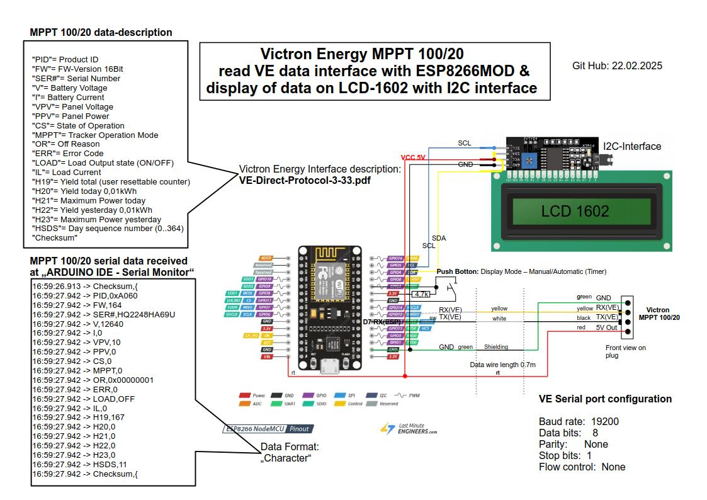

# Victron Energy MPPT 100/20 read VE data interface with ESP8266MOD & display data on LCD-1602 with I2C interface
Code to read the VE.Direct-Protocol from serial into a value array. Uses a non-blocking read loop and does checksum verification before adding the data. Extra care has been taken to not used `readByteUntil()` or any other blocking serial command that can mess with background services, especially on the ESP8266. This part was used 1:1 from "serial.Read.ino"

## Display LCD-1602
This code was extended by I2C Interface for LCD-1602 display. This display has 2 rows with 16 ASCII characters each row.

### Automatic mode 
To show the most important VE data with this display:  
| Victron Energy Key | Description |
| ------------- | ------------- |  
| **V**   | Battery Voltage |
| **I**   | Battery Current |
| **VPV** | Panel Voltage |
| **PPV** | Panel Power |
| **CS**  | State of Operation |
| **H19** | Yield total (user resettab counter) |
| **H20** | Yield today 0.01kWh |
| **H21** | Maximum Power today |

The display is divided into 4 screens, each of which is displayed for 4 seconds. 

### Function of the pushbutton 

1) Short push-button action
The background lighting is switched on by briefly pressing the pushbutton. In automatic mode, the backlighting is switched off again after 2 complete cycles of the 4 screens, after 30 sec.

2) Long push-button action
A long press on the push-button switches between manual and automatic mode.

### Manual mode
In manual mode, you can switch through the 4 screens with a short press of the button.

## Content of the 4 screens

**LCD Display 16x2**

**Screen 1**
|1|2|3|4|5|6|7|8|9|10|11|12|13|14|15|16|
|-|-|-|-|-|-|-|-|-|-|-|-|-|-|-|-|
|V|B|A|T| |2|0|V| | |S|T|A|T|E| |
|I|B|A|T| |2|6|A| | |F|L|O|A|T| |  

CS=0 -> OFF  
CS=3 -> BULK  
CS=4 -> ABSORPTION  
CS=5 -> FLOAT  
CS=7 -> EQUALIZE (manual)  

**Screen 2**
|1|2|3|4|5|6|7|8|9|10|11|12|13|14|15|16|
|-|-|-|-|-|-|-|-|-|-|-|-|-|-|-|-|
|V|P|V| | |2|9|V| |I|P|V| |1|1|A|
|P|P|V| | |7|2|W| | | | | | | | |  

IPV=PPV/VPV  

**Screen 3**
|1|2|3|4|5|6|7|8|9|10|11|12|13|14|15|16|
|-|-|-|-|-|-|-|-|-|-|-|-|-|-|-|-|
|P|T|O|D|A|Y| |2|8|0|W| | | | | |
|P|M|A|X| | | | |8|0|W| | | | | |  

PTODAY=H20  
Pmax=H21

**Screen 4**
|1|2|3|4|5|6|7|8|9|10|11|12|13|14|15|16|
|-|-|-|-|-|-|-|-|-|-|-|-|-|-|-|-|
|T|O|T|A|L| |P|O|W|E|R| | | | | |
| | | | | | | | |1|2|.|0|0|k|W|h|  

TOTAL POWER = H19  

## Config
At the moment the MPPT 75/10 and the 100/20 are configured in the `config.h`.

## Circuit diagram

## Usage
Make sure the RX and TX of the VE.Direct-Protocol are connected to the corresponding pins in the setup, `victronSerial`. On the NodeMCU, pins D7/D8 are used.

Every second the MPPT sends out data, this is put into the `value` array. As per code the `PrintValues()` function loops of the array and prints the values and keys. 

The values can also be used with the macros defined, eg. `value[VPV]` or `value[ERR]`.

Note that the values are stored as chars, so convert to suitable types with functions like: `atof()` or `atoi()` etc. 
